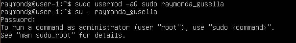
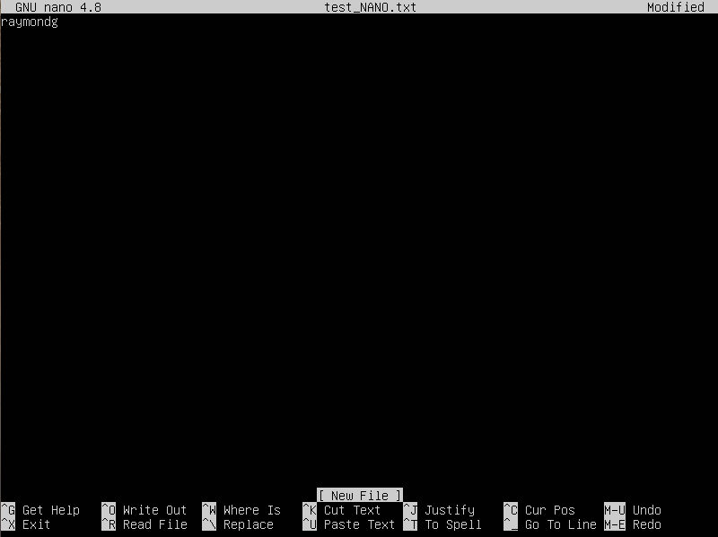
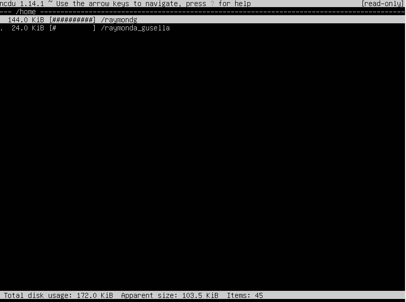

## 1. Установка ОС

- Проверка версии ОС: `cat /etc/issue`

## 2. Создание пользователя

- Создание пользователя `sudo adduser raymonda_gusella`

- Добавление пользователя в группу adm `sudo usermod -aG adm raymonda_gusella`

- Ввод команды `cat /etc/passwd`

## 3. Настройка сети ОС

- Задание названия машине вида user-1

- Установление временной зоны `sudo timedatectl set-timezone Europe/Moscow`

- Вывод названия сетевых интерфейсов `ip link show`

Интерфейс lo (loopback device) - присутствует по умолчанию. Используется для отладки сетевых программ и запуска серверных приложений на локальной машине.

- Получаю ip адресс устройства от DHCP сервера `sudo dhclient -v`

DHCP (dynamic host configuration protocol) - сетевой протокол для автоматического назначения IP-адреса.

- Внешний ip-адресс шлюза `curl icanhazip.com`

- Внутренний ip-адресс шлюза `ip rout | grep default`

- Задание статичных настроек ip, gw, dns `sudo vim /etc/netplan/00-installer-config.yaml`

- Применение изменений `sudo netplan apply`

- Перезагрузка `sudo reboot`

- Пропинговала удаленные хосты 1.1.1.1 и ya.ru

## 4. Обновление ОС

- Обновление системы `sudo apt-get update` `sudo apt-get upgrade`

## 5. Использование команды sudo

- Разрешение новому пользователю использованию программы sudo `sudo usermod -aG sudo raymonda_gusella`

- Изменение hostname `sudo hostnamectl set-hostname raymonda-host`

## 6. Установка и настройка службы времени

- `timedatectl show`

## 7. Установка и использование текстовых редакторов

### VIM 

- для выхода с сохранением `esc :wq enter`

- для выхода без сохранения `esc :q! enter`

- Поиск слова `esc :s/"слово, которое ищем" enter`

- Замена слова на другое `esc :s/"слово, которое будем менять"/"слово, которым заменим"/g enter`

### NANO

- для выхода с сохранением `ctrl+O y ctrl+X`

- для выхода без сохранения `ctrl+X n`

- Поиск слова `ctrl+W "слово" enter`

- Замена слова на другое `ctrl+\ enter "слово" enter "слово" Y enter`

### JOE

- для выхода с сохранением `ctrl+K ctrl+X`

- для выхода без сохранения `ctrl+K ctrl+C n enter`

- Поиск слова `ctrl+K F "слово" enter b enter`

- Замена слова на другое `ctrl+K F "слово-1" enter r "слово-2 enter"`

## 8. Установка и базовая настройка сервиса SSHD

- Добавление автостарта службы при загрузке системы `sudo systemctl enable ssh`

- Перенастройка службы SSHd на порт 2022

- Налииче процесса sshd `ps -ef | grep sshd`

1. -e - отображение всех процессов

2. -f - полный формат вывода

- Вывод команды `nestat -tan`

1. -t - отображает толко ТСР соединения

2. -а - показывает все соединения и прослушиваемые порты

3. -n - отображает адреса и порты в числовом формате, без попытки разрешить имена

4. Proto - протокол (tcp/upd)

5. Recv-Q - очередь полученных данных, ожидающих обработки (байт)

6. Send-Q - очередь отправленных данных, ожидающих отправки (байт)

7. Local Address - локальный адрес и порт

8. Foreign Address - удаленный адрес и порт

9. State - состояние соединения

10. 0.0.0.0 - IP-адресс 0.0.0.0 указан в качестве локального адреса

## 9. Установка и использрвание утилиты top, htop

### top

- uptime: 8 мин

- количество авторизованных пользователей: 1

- общая загрузка системы: 0.00, 0.05, 0.05

- общее количество процессов: 113

- загрузка cpu: 0.0% пользовательского времени, 0.2% - системного времени, 99.8% - простаивание

- загрузка памяти: 1971.1

- pid процесс, занимающий больше всего памяти: 1

- pid процесс, занимающий больше всего процессорного времени: 5

### htop

- Сортировка `PID` `fn + F6`

- Сортировка `PERCENT_CPU`

- Сортировка `PERCENT_MEM`

- Сортировка `TIME`

- Отфильтрованный для процесса sshd `fn + F4`

- C процессом syslog `fn + F3`

- C добавлением hostname, clock, uptime `fn + F2`

## 10. Использование утилиты fdisk

- Название жесткого диска: /dev/sda

- Размер: 25 GiB

- Количество секторов: 52428800

- Размер swap: 2.0 Gi

## 11. Использование утилиты df

- Запуск команды df

1. Pазмер раздела: 11758760

2. Pазмер занятого пространства: 4878492

3. Pазмер свободного пространства: 6261160

4. Процент использования: 44%

5. Единица измерения: килобайты

- Запуск команды df -Th

1. Pазмер раздела: 12G

2. Pазмер занятого пространства: 4.7G

3. Pазмер свободного пространства: 6.0G

4. Процент использования: 44%

5. Тип файловой системы: ext4

## 12. Использование утилиты du

- Размер папок /home /var /var/log

- Размер всего содержимого в /var/log

## 13. Установка и использование утилиты nsdu

- Размер папки /home

- Размер папки /var

- Размер папки /var/log

## 14. Работа с системными журналами

1. `nano /var/log/dmesg`

2. `nano /var/log/syslog`

3. `nano /var/log/auth.log`

- Bремя последней успешной авторизации, имя пользователя и метод входа в систему

- Перезапуск службы SSHd `sudo systemctl restart ssh`

## 15. Использование планировщика CRON

- Запуск команды uptime `crontab -e`

- `sudo vim /var/log/syslog`

- Вывод списка текущих задач `crontab -l`

- Удаление всех задач `crontab -r`

